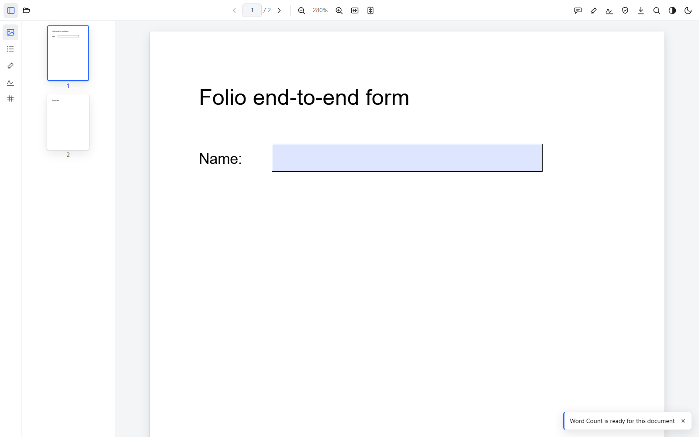
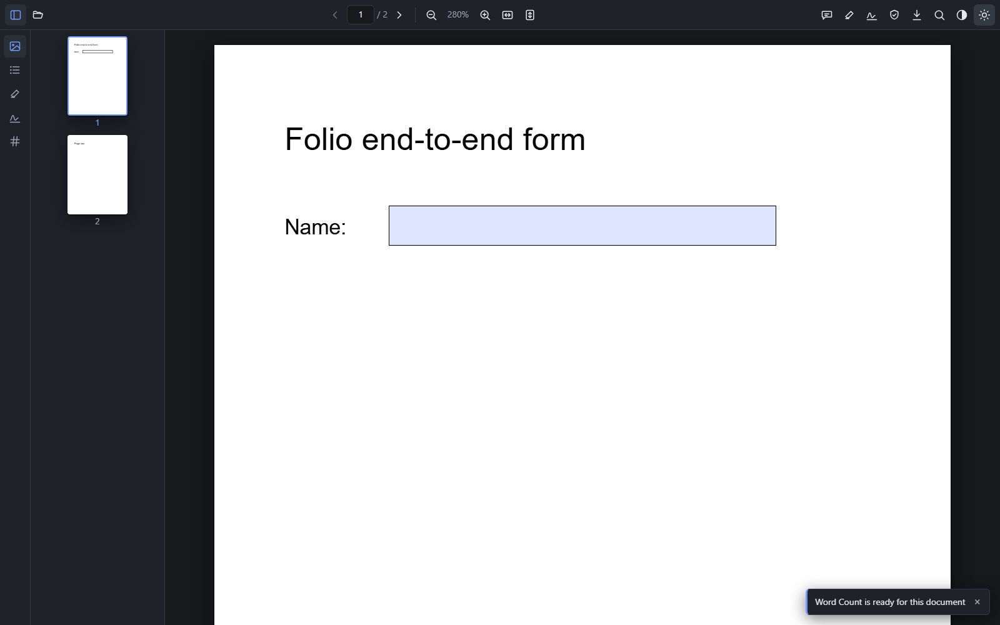

<div align="center">

# Folio

**A world-class, open-source PDF viewer.** Fast, accessible, extensible, and dark-mode native.

[](LICENSE)
[](https://tauri.app)
[](https://react.dev)
[](CONTRIBUTING.md)

</div>

Folio is a desktop PDF reader that aims for Adobe Acrobat-caliber quality while
staying free, open source, and a pleasure to build on. It renders with
[PDF.js](https://mozilla.github.io/pdf.js/), wraps a modern React interface in a
native [Tauri](https://tauri.app) shell, and is designed from the first commit
around three things Acrobat treats as afterthoughts: **accessibility**,
**a real dark mode**, and **extensibility**.

> Status: early foundation (v0.1). The core viewer, text highlighting, theming,
> accessibility, the plugin system, and the AI/MCP scaffolding are in place. See
> the [roadmap](ROADMAP.md).

## Screenshots

Folio rendering a two-page form PDF, in light and dark:

| Light | Dark |
| :---: | :---: |
|  |  |

## Features

**Reading**
- Open, render, and navigate PDFs with a continuous, lazily-rendered page view
- Zoom, fit-to-width, fit-to-page, and a live page indicator
- Thumbnail strip and document outline (bookmarks)
- Fast in-document text search with a results list

**Accessibility (first-class, not bolted on)**
- Real text layer over every page: selectable, screen-reader readable
- Full keyboard control with a command-driven shortcut system
- ARIA landmarks and roles, a skip link, and live-region announcements
- Respects `prefers-reduced-motion`; targets WCAG 2.2 AA

**Dark mode and reading comfort**
- Native light / dark / system UI theming via CSS custom properties
- Page reading modes: normal, night (inverted), sepia, and high-contrast

**Annotations**
- Highlight selected text; annotations persist per document
- Comments: select text to comment on it (the passage is underlined), or drop a
  point comment on a figure; drag to reposition, edit inline
- Annotations panel to review and jump between them

**AI-locatable review**
- Each sticky note captures its page, position, and the text it sits next to, so
  when the document is handed to the AI layer it knows exactly where every note
  applies, for grounded comments and feedback

**Editing and OCR**
- Add **text boxes** (typewriter tool with font, size, bold, and color) and place
  **images** (PNG/JPEG); drag, resize, and bake them into a saved copy
- **OCR** scanned pages with a bundled, offline English engine (tesseract.js): the
  recognized text becomes selectable on screen, is searchable in-app, and is baked
  into the saved PDF as an invisible searchable layer
- Additive editing only for now: existing PDF text is not modified (see the
  [roadmap](ROADMAP.md))

**Forms and signing**
- Fill interactive AcroForm fields (text, checkbox, radio, dropdown)
- Sign by drawing, typing, or uploading a signature; place, drag, and resize it
- Cryptographic digital signatures (PKCS#7): import a `.p12` or create a
  self-signed identity; opened signed PDFs show the signer and tamper status
- Save a copy with form values and signatures baked in (original untouched)

**Extensible**
- A plugin system: contribute commands, toolbar items, sidebar panels, and tools
- Every action flows through a command registry, so plugins get shortcuts for free

**Desktop and distribution**
- EV-signed Windows installer; installs per-user and **auto-updates** from GitHub Releases
- Set Folio as your **default PDF viewer**: double-click a `.pdf` to open it in Folio (there's a one-click "make default" action on the start screen)
- Open PDFs from your browser: a Chrome extension renders them in Folio, or hands off to the desktop app via a `folio://` deep link

**AI-ready**
- A provider-agnostic AI layer with an experimental, opt-in Claude provider (bring-your-own-key)
- Summarize, ask-about-the-document, and structured extraction (experimental)
- Model Context Protocol (MCP) client/server support planned; the tool surface is stubbed out

See [`docs/`](docs/) for the full documentation set.

## Tech stack

| Layer      | Choice                                             |
| ---------- | -------------------------------------------------- |
| Shell      | [Tauri 2](https://tauri.app) (Rust)                |
| UI         | [React 18](https://react.dev) + TypeScript         |
| Build      | [Vite](https://vitejs.dev)                         |
| Rendering  | [PDF.js](https://mozilla.github.io/pdf.js/)        |
| State      | [Zustand](https://github.com/pmndrs/zustand)       |
| Testing    | [Vitest](https://vitest.dev) + [Playwright](https://playwright.dev) |

## Quick start

Prerequisites: **Node 20+**, **Rust (stable)**, and the Tauri system
dependencies for your OS. Full setup, including the exact Linux packages, is in
[docs/getting-started.md](docs/getting-started.md).

```bash
# Install dependencies
npm install

# Run the desktop app in development (hot reload)
npm run tauri dev

# Build a production bundle for your platform
npm run tauri build
```

Prefer a single command? [`run.py`](run.py) is a stdlib-only launcher that wraps
these plus the VS Code extension:

```bash
python run.py            # interactive menu
python run.py dev        # Folio in the browser (opens it; closing the window stops the server)
python run.py ext a.pdf  # build + open the VS Code extension on a PDF
python run.py doctor     # check prerequisites
```

Other useful scripts:

```bash
npm run dev          # Vite dev server only (opens in a browser, no native shell)
npm run test         # unit tests (Vitest)
npm run lint         # ESLint
npm run typecheck    # tsc --noEmit
```

> First-time build note: app icons must exist for Tauri to compile. Generate
> them once with `npm run tauri icon src/assets/folio-logo.svg` (see
> [src-tauri/icons/README.md](src-tauri/icons/README.md)).

## Keyboard shortcuts

| Action            | Shortcut                    |
| ----------------- | --------------------------- |
| Open document     | `Ctrl/Cmd + O`              |
| Save a copy       | `Ctrl/Cmd + S`              |
| Find in document  | `Ctrl/Cmd + F`              |
| Zoom in / out     | `Ctrl/Cmd + =` / `Ctrl/Cmd + -` |
| Actual size       | `Ctrl/Cmd + 0`              |
| Next / prev page  | `→` / `←`                   |
| First / last page | `Ctrl/Cmd + Home` / `End`   |
| Toggle sidebar    | `Ctrl/Cmd + B`              |
| Highlight text    | `Ctrl/Cmd + Shift + H`      |
| Toggle dark mode  | `Ctrl/Cmd + Shift + L`      |

The complete list, plus the accessibility model, is in
[docs/accessibility.md](docs/accessibility.md).

## Project structure

```
folio/
├─ src/                  React + TypeScript frontend
│  ├─ core/pdf/          PdfEngine interface + PDF.js implementation
│  ├─ commands/          command registry (every user action)
│  ├─ components/        Viewer, Toolbar, Sidebar, Search, common
│  ├─ features/          annotations, editing, ocr, signatures, forms, save/export
│  ├─ plugins/           plugin host, SDK types, built-in Word Count plugin
│  ├─ ai/                provider-agnostic AI layer (Claude, experimental) + MCP stubs
│  ├─ theme/             tokens, ThemeProvider, reading modes
│  ├─ a11y/              announcer, focus, keyboard shortcuts
│  ├─ state/             Zustand stores
│  ├─ styles/            global CSS
│  ├─ assets/            app-icon source (folio-logo.svg)
│  └─ test/              test setup
├─ src-tauri/            Rust backend (file IO, native shell)
├─ extensions/vscode/    VS Code extension: view PDFs in an editor tab (preview)
└─ docs/                 architecture, accessibility, theming, plugins, AI
```

Architecture deep-dive: [docs/architecture.md](docs/architecture.md).

## Documentation

- [Getting started](docs/getting-started.md)
- [Architecture](docs/architecture.md)
- [Accessibility](docs/accessibility.md)
- [Editing and OCR](docs/editing-and-ocr.md)
- [Forms and signatures](docs/forms-and-signatures.md)
- [Theming](docs/theming.md)
- [Writing plugins](docs/plugins.md)
- [AI and MCP](docs/ai.md)
- [Testing](docs/testing.md)
- [Releasing](docs/releasing.md) (signed installer + auto-updater)
- [VS Code extension](extensions/vscode/README.md) (preview: view PDFs in an editor tab)
- [Chrome extension](extensions/chrome/README.md) (preview: open PDFs in Folio from the browser)
- [Roadmap](ROADMAP.md)

## Contributing

Contributions are welcome. Please read [CONTRIBUTING.md](CONTRIBUTING.md) and our
[Code of Conduct](CODE_OF_CONDUCT.md). Good first issues are labeled in the
tracker.

## License

[MIT](LICENSE) © 2026 the Folio contributors.
