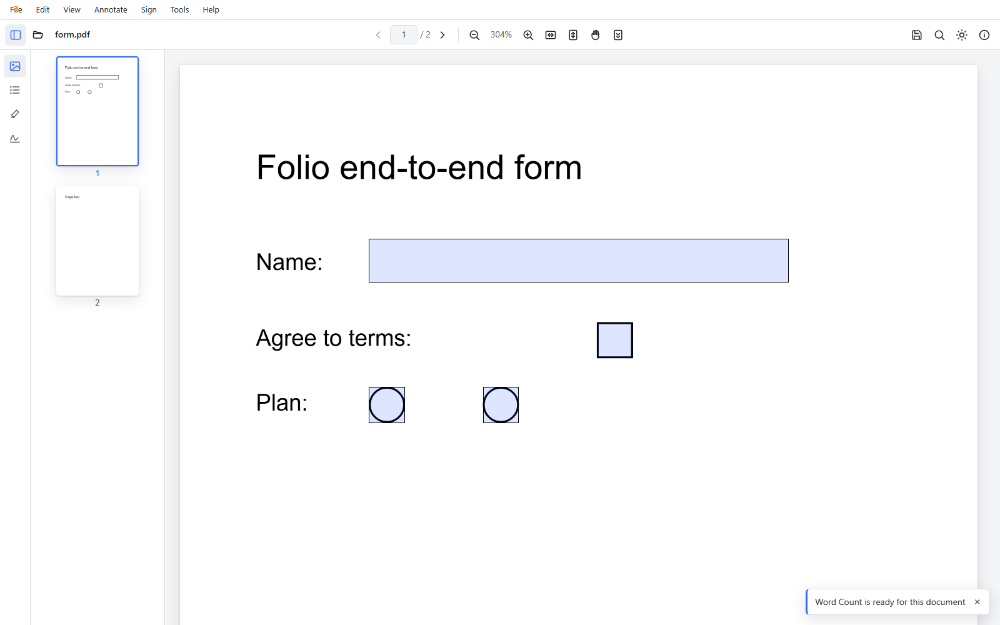
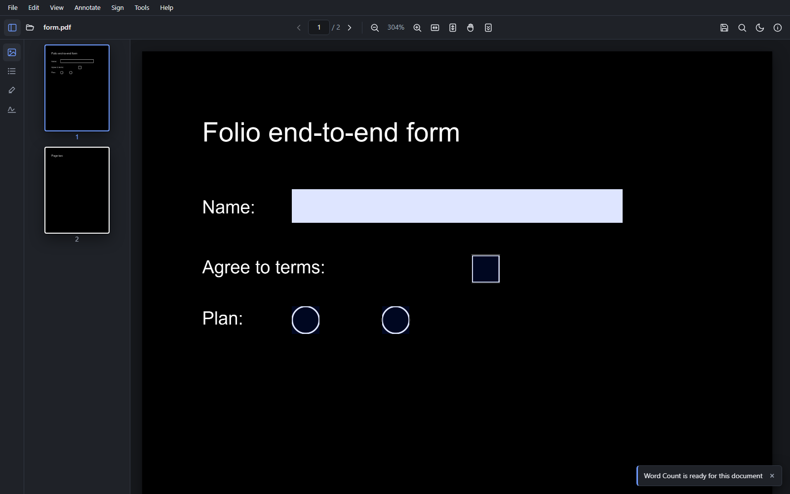

<div align="center">

# Folio

**A world-class, open-source PDF viewer.** Fast, accessible, extensible, and dark-mode native.

[](LICENSE)
[](https://tauri.app)
[](https://react.dev)
[](CONTRIBUTING.md)

</div>

Folio is a desktop PDF reader that aims for Adobe Acrobat-caliber quality while
staying free, open source, and a pleasure to build on. It renders with
[PDF.js](https://mozilla.github.io/pdf.js/), wraps a modern React interface in a
native [Tauri](https://tauri.app) shell, and is designed from the first commit
around three things Acrobat treats as afterthoughts: **accessibility**,
**a real dark mode**, and **extensibility**.

> Status: in development (v0.5). The core viewer, printing, forms, annotations
> that embed into a saved copy, editing, OCR, visual and cryptographic signing,
> theming, accessibility (Section 508), the plugin system, and the AI/MCP
> scaffolding are in place. See the [roadmap](ROADMAP.md).

## Screenshots

Folio rendering a two-page form PDF, in light and dark:

| Light | Dark |
| :---: | :---: |
|  |  |

## Features

**Reading**
- Open, render, and navigate PDFs with a continuous, lazily-rendered page view
- Zoom (snaps to clean preset levels), fit-to-width, fit-to-page, and a live page indicator
- Hand (pan) tool with 1:1 cursor tracking, plus middle-click drag-to-pan in any mode
- Continuous auto-scroll (teleprompter-style), with adjustable speed and keyboard control
- Classic application menu bar (File, Edit, View, Annotate, Sign, Tools, Help)
  with full keyboard operation; the toolbar keeps the everyday buttons
- Acrobat-style right-click context menu for common tools and actions
- Thumbnail strip and document outline (bookmarks)
- Fast in-document text search with a results list
- Print to the system print dialog, with everything you placed on the page
  (text, images, check marks, signatures, highlights) baked into the output

**Accessibility (first-class, not bolted on)**
- Real text layer over every page: selectable, screen-reader readable
- Full keyboard control with a command-driven shortcut system
- Everything you place on a page (text boxes, images, check marks, signatures)
  can be moved, resized, and deleted from the keyboard, not only by dragging.
  Images already embedded in the PDF can be deleted the same way, and moved and
  resized too where the file's own structure allows it
- ARIA landmarks and roles, a skip link, and live-region announcements
- Respects `prefers-reduced-motion`; targets WCAG 2.2 AA

**Dark mode and reading comfort**
- Native light / dark / system theming via CSS custom properties, unified across the UI chrome and the rendered page: toggling dark darkens the whole app and inverts the page together, rendered at full resolution for crisp text
- Selectable dark reading schemes (Acrobat-style): Night (white-on-black), Green, and Amber
- One appearance button in the toolbar opens the whole viewing mode: Light / Dark / Match system above, the dark reading colors below; the View menu carries the same settings for keyboard users
- Responsive down to phone widths: on narrow windows the sidebar becomes an
  overlay drawer, the menu bar folds into a hamburger menu, toolbar tools fold
  into the More menu (everything stays reachable), and touch screens get
  larger hit targets

**Annotations**
- Highlight selected text; annotations persist per document
- Comments: select text to comment on it (the passage is underlined), or drop a
  point comment on a figure; drag to reposition, edit inline
- Annotations panel to review and jump between them

**AI-locatable review**
- Each sticky note captures its page, position, and the text it sits next to, so
  when the document is handed to the AI layer it knows exactly where every note
  applies, for grounded comments and feedback

**Editing and OCR**
- Add **text boxes** (typewriter tool with font, size, bold, and color) and place
  **images** (PNG/JPEG): click where it goes, then drag from anywhere on it,
  resize, and bake it into a saved copy
- **Edit text already on the page**, in place: click a run of text to replace
  it; the original is removed from the page's content, not just covered up
  (undo with Ctrl/Cmd + Z, up to 10 edits). Text drawn inside a Form XObject,
  the usual shape of a template or a generated form, is editable too
- **Edit images already on the page**, in place: click one to drag it, resize
  it from the corner, replace it with a different PNG/JPEG, or delete it,
  leaving the original image untouched for any other page still drawing it
- Place a **check mark** anywhere, for forms that print an empty box with no
  interactive field behind it; a placed mark can be switched to a cross
- **OCR** scanned pages with a bundled, offline English engine (tesseract.js): the
  recognized text becomes selectable on screen, is searchable in-app, and is baked
  into the saved PDF as an invisible searchable layer
- In-place text edits use a substituted standard font, one run at a time, with
  no paragraph reflow, and text inside a form the page draws more than once is
  still refused. Rotated and skewed images can be replaced but not moved or
  resized, images inside a Form XObject are read-only, and non-Latin text
  remains on the [roadmap](ROADMAP.md)

**Forms and signing**
- Fill interactive AcroForm fields (text, checkbox, radio, dropdown)
- Sign by drawing, typing, or uploading a signature; click where it goes, then
  drag and resize it. Typed names are remembered, so signing again is two clicks
- Cryptographic digital signatures (PKCS#7): import a `.p12` or create a
  self-signed identity; opened signed PDFs show the signer and tamper status
- Save back to the opened file (atomically), or save a copy, with form values,
  placed edits, in-place text and image edits, OCR text, signatures, and
  annotations all included

**Extensible**
- A plugin system: contribute commands, toolbar items, sidebar panels, and tools
- Every action flows through a command registry, so plugins get shortcuts for free

**Desktop and distribution**
- EV-signed Windows installer; installs per-user and **auto-updates** from GitHub Releases
- Set Folio as your **default PDF viewer**: pick it from *Open with*, or use the start-screen shortcut into *Settings → Default apps*, and double-clicking a `.pdf` opens it in Folio (Windows reserves the actual switch for the user, so Folio cannot silently take over a default the user already chose)
- **Replace Chrome's PDF reader**: a Chrome extension opens PDFs in Folio's viewer instead, catching them by content-type as well as by `.pdf` URL, so documents served from behind an app (`/download?id=…`) are caught too. Choose per-site, or turn it off; or hand the document to the desktop app via a `folio://` deep link
- **About dialog** with app version, commit hash, and build date, plus a manual "Check for updates" action (desktop)

**AI-ready**
- A provider-agnostic AI layer with an experimental, opt-in Claude provider (bring-your-own-key)
- Summarize, ask-about-the-document, and structured extraction (experimental)
- Model Context Protocol (MCP) client/server support planned; the tool surface is stubbed out

See [`docs/`](docs/README.md) for the full documentation set, indexed by what you
are trying to do.

## Tech stack

| Layer      | Choice                                             |
| ---------- | -------------------------------------------------- |
| Shell      | [Tauri 2](https://tauri.app) (Rust)                |
| UI         | [React 19](https://react.dev) + TypeScript         |
| Build      | [Vite](https://vitejs.dev)                         |
| Rendering  | [PDF.js](https://mozilla.github.io/pdf.js/)        |
| State      | [Zustand](https://github.com/pmndrs/zustand)       |
| Testing    | [Vitest](https://vitest.dev) + [Playwright](https://playwright.dev) |

## Quick start

Prerequisites: **Node 22.22.2+**, **Rust (stable)**, and the Tauri system
dependencies for your OS. Full setup, including the exact Linux packages, is in
[docs/getting-started.md](docs/getting-started.md).

```bash
# Install dependencies
npm install

# Run the desktop app in development (hot reload)
npm run tauri dev

# Build a production bundle for your platform
npm run tauri build
```

Prefer a single command? [`run.py`](run.py) is a stdlib-only launcher that wraps
these plus the VS Code extension:

```bash
python run.py            # just open Folio in the browser (closing the window stops the server)
python run.py menu       # interactive menu of every way to run it
python run.py ext a.pdf  # build + open the VS Code extension on a PDF
python run.py doctor     # check prerequisites
```

Other useful scripts:

```bash
npm run dev          # Vite dev server only (opens in a browser, no native shell)
npm run test         # unit tests (Vitest)
npm run lint         # ESLint
npm run typecheck    # tsc --noEmit
```

> First-time build note: app icons must exist for Tauri to compile. Generate
> them once with `npm run tauri icon src/assets/folio-logo.svg` (see
> [src-tauri/icons/README.md](src-tauri/icons/README.md)).

## Keyboard shortcuts

| Action            | Shortcut                    |
| ----------------- | --------------------------- |
| Open document     | `Ctrl/Cmd + O`              |
| Save              | `Ctrl/Cmd + S`              |
| Save a copy       | `Ctrl/Cmd + Shift + S`      |
| Print             | `Ctrl/Cmd + P`              |
| Find in document  | `Ctrl/Cmd + F`              |
| Zoom in / out     | `Ctrl/Cmd + =` / `Ctrl/Cmd + -` |
| Actual size       | `Ctrl/Cmd + 0`              |
| Next / prev page  | `→` / `←`                   |
| Scroll up / down  | `Page Up` / `Page Down`     |
| First / last page | `Ctrl/Cmd + Home` / `End`   |
| Toggle sidebar    | `Ctrl/Cmd + B`              |
| Highlight text    | `Ctrl/Cmd + Shift + H`      |
| Add sticky note   | `Ctrl/Cmd + Shift + M`      |
| Toggle light / dark | `Ctrl/Cmd + Shift + L`    |

The complete list, plus the accessibility model, is in
[docs/accessibility.md](docs/accessibility.md).

## Project structure

```
folio/
├─ src/                  React + TypeScript frontend
│  ├─ core/pdf/          PdfEngine interface + PDF.js implementation
│  ├─ commands/          command registry (every user action)
│  ├─ components/        Viewer, MenuBar, Toolbar, Sidebar, Search, common
│  ├─ features/          annotations, editing, placement, textedit, imageedit, ocr, signatures, forms, save/export
│  ├─ plugins/           plugin host, SDK types, built-in Word Count plugin
│  ├─ ai/                provider-agnostic AI layer (Claude, experimental) + MCP stubs
│  ├─ theme/             tokens, ThemeProvider, dark schemes, breakpoints
│  ├─ hooks/             shared React hooks (media queries, DPI-change watch)
│  ├─ a11y/              announcer, focus, keyboard shortcuts
│  ├─ state/             Zustand stores
│  ├─ styles/            global CSS
│  ├─ assets/            app-icon source (folio-logo.svg)
│  └─ test/              test setup
├─ src-tauri/            Rust backend (file IO, native shell)
├─ extensions/chrome/    Chrome extension: Folio's viewer instead of Chrome's PDF reader
├─ extensions/vscode/    VS Code extension: view PDFs in an editor tab (preview)
├─ e2e/                  Playwright end-to-end suite
├─ scripts/              build, release, and version/manifest parity checks
└─ docs/                 architecture, accessibility, theming, plugins, AI
```

Architecture deep-dive: [docs/architecture.md](docs/architecture.md).

## Documentation

- [Getting started](docs/getting-started.md)
- [Architecture](docs/architecture.md)
- [Accessibility](docs/accessibility.md)
- [Section 508 conformance](docs/508-conformance.md) (what is supported, and the open gaps)
- [Editing and OCR](docs/editing-and-ocr.md)
- [Forms and signatures](docs/forms-and-signatures.md)
- [Theming](docs/theming.md)
- [Writing plugins](docs/plugins.md)
- [AI and MCP](docs/ai.md)
- [Testing](docs/testing.md)
- [Releasing](docs/releasing.md) (signed installer + auto-updater) and the [release checklist](docs/release-checklist.md)
- [VS Code extension](extensions/vscode/README.md) (preview: view PDFs in an editor tab)
- [Chrome extension](extensions/chrome/README.md) (replace Chrome's PDF reader with Folio's viewer, or hand the document to the desktop app)
- [Browser extension privacy policy](docs/browser-extension-privacy.md)
- [Roadmap](ROADMAP.md)

## Contributing

Contributions are welcome. Please read [CONTRIBUTING.md](CONTRIBUTING.md) and our
[Code of Conduct](CODE_OF_CONDUCT.md). Good first issues are labeled in the
tracker.

## License

[MIT](LICENSE) © 2026 the Folio contributors.
