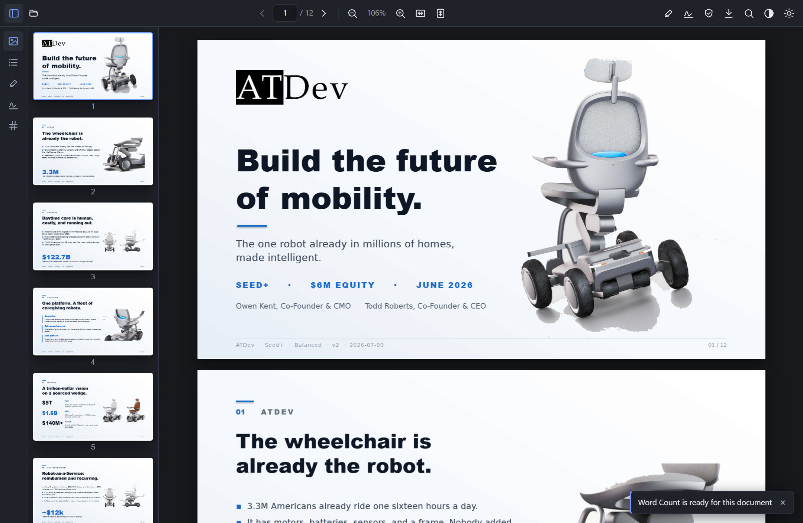

# Folio PDF Viewer

**A fast, accessible, dark-mode-native PDF viewer, right inside VS Code.**
Open any `.pdf` and it renders in an editor tab with a real toolbar, thumbnails,
outline, search, and text selection — and it follows your VS Code color theme.

## Features

- **Opens PDFs in an editor tab** — no external app, no round-trip.
- **Native dark mode** — the viewer follows your VS Code theme and switches live.
- **Thumbnails, outline, and search** — navigate long documents fast.
- **Real text layer** — select and copy text; screen-reader friendly.
- **Zoom, fit-to-width, fit-to-page**, and a live page indicator.
- **Dark reading schemes** - Night, Green, and Amber, rendered at full resolution for crisp text.
- Built on [PDF.js](https://mozilla.github.io/pdf.js/) and the
  [Folio](https://github.com/owenpkent/folio) viewer.

> **Preview.** The viewer is fully functional. Editing (form fill, annotations,
> signatures) is not yet written back to disk — **Save** downloads a copy for
> now. Saving in place is on the [roadmap](#roadmap).

## Install

- **Marketplace:** search **“Folio PDF Viewer”** in the Extensions view and click Install.
- **From a `.vsix`:** `code --install-extension folio-vscode-0.0.1.vsix`, or
  Extensions view → **⋯ → Install from VSIX…**.

Then open any PDF. If it opens as raw bytes, right-click the tab →
**Reopen Editor With… → Folio PDF Viewer**.

## How it works

VS Code registers a [custom editor](https://code.visualstudio.com/api/extension-guides/custom-editors)
for `*.pdf`. The extension hands a webview the file; the webview mounts the real
Folio React app and renders it with PDF.js. The viewer's theme is bridged from
VS Code's active color theme.

## Roadmap

- **Save in place** — wire `Ctrl+S` and the editor's dirty state to Folio's
  export pipeline so filled forms and signatures write back to the file.
- **Annotation persistence** into the document.
- **Cryptographic signing** surfaced in the editor.

## Develop & distribute

Building, running (F5 / Extension Development Host), and the full publishing
walkthrough live alongside the source:

- Architecture, build & run: [DEVELOPING.md](DEVELOPING.md)
- Distribution guide: [DISTRIBUTING.md](DISTRIBUTING.md)
- Source: [github.com/owenpkent/folio/tree/main/extensions/vscode](https://github.com/owenpkent/folio/tree/main/extensions/vscode)

## License

[MIT](LICENSE.txt) © the Folio contributors. Powered by
[Folio](https://github.com/owenpkent/folio) and [PDF.js](https://mozilla.github.io/pdf.js/).
